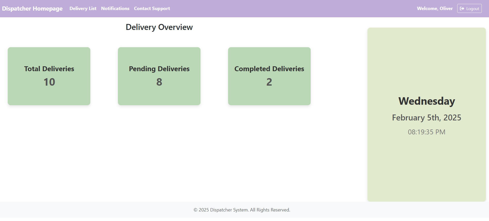
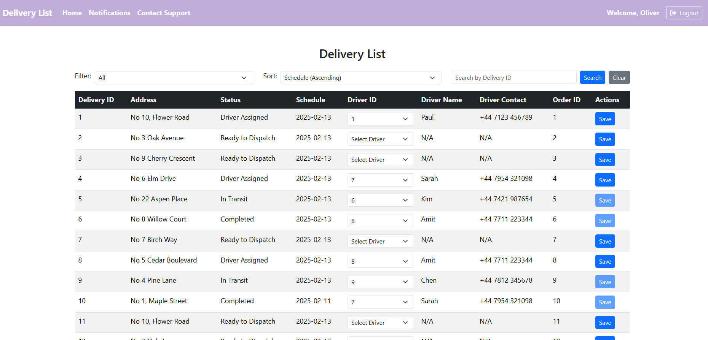

## Delivery Management System

This is a PHP-based Delivery Management System designed to automate and optimize delivery assignment and tracking for dispatchers. 

### **Project Structure**

├── 01_src/                     &ensp;# Main source code  
│   ├── commons/                &ensp;# Database connection  
│   ├── controller/             &ensp;# Business logic controllers  
│   ├── model/                  &ensp;# Data models  
│   ├── view/                   &ensp;# Frontend views  
│   ├── css/                     &ensp;# Stylesheets for UI design  
│   ├── js/                      &ensp;# JavaScript files for client-side interactions  
│   └── bootstrap/               &ensp;# Bootstrap CSS/JS for UI styling and responsiveness  
├── 02_tests/                   &ensp;# Testing folder  
│   ├── phpunit/                &ensp;# Unit tests written for PHPUnit  
│   ├── selenium/               &ensp;# Selenium scripts for automated integration testing  
├── 03_docs/                    &ensp;# Documentation folder  
│   ├── 01_UML_diagrams/        &ensp;# Contains UML diagrams  
│   ├── 02_tests/               &ensp;# Includes test cases and results log</br>
│   ├── 03_UI_design_canva/     &ensp;# UI design created using Canva  
│   ├── transcript/             &ensp;# Interview between client and BA  
│   ├── Use_case_1.1_description/  &ensp;# Detailed description of use case  
│   ├── User_stories_Use_cases_Product_backlog/  &ensp;# Initial user stories, use cases, product backlog, sprint backlog  </br>
│   └── Database.sql            &ensp;# SQL script for database setup  
├── composer.json               &ensp;# Composer dependency configuration  
├── phpunit.xml                 &ensp;# PHPUnit configuration file  
├── index.php                   &ensp;# Entry point of the application  
├── .gitignore                  &ensp;# Git ignored files and folders  
 
### UI Design
Here is a preview of the UI for the application:<br/>




## How to Clone and Run the Application

### Step 1: Clone the Repository  
Open a terminal and run the following command:  
```sh
git clone https://github.com/erandime/Delivery-Management-System.git

### Step 2: Navigate to the Project Directory
cd Delivery-Management-System

### Step 3: Install Dependencies
composer install

## Step 4: Start XAMPP Services
Start Apache and MySQL services.

### Step 5: Set Up the Database
Open phpMyAdmin (http://localhost/phpmyadmin/).
Create a new database: msc_sdp_delivery_mgt_cb015490
Import the Database.sql file from 03_docs/ into your MySQL or MariaDB server.
Ensure 01_src/commons/db_connection.php contains the correct credentials.

### Step 6:Run the Application
php -S localhost:8000 -t .

Then open http://localhost:8000 in your browser.

## **Prerequisites**
Before proceeding, ensure you have the following installed:

- **Git** 
- **PHP 8.0+** 
- **Composer** 
- **XAMPP (Apache & MySQL)** 